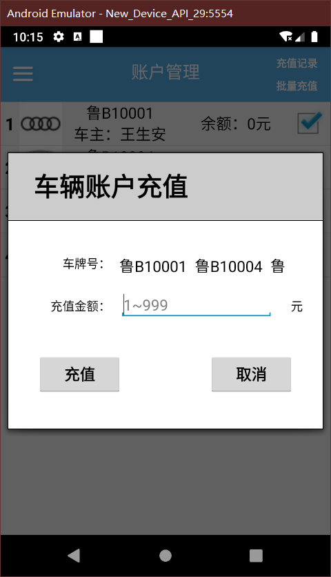

# 账户管理


## **`XML就是一个`ListView**

```xml
<?xml version="1.0" encoding="utf-8"?>
<LinearLayout xmlns:android="http://schemas.android.com/apk/res/android"
    android:layout_width="match_parent"
    android:layout_height="match_parent"
    android:background="#f1f1f1"
    android:orientation="vertical" >
    <ListView
        android:id="@+id/lv_car"
        android:layout_width="match_parent"
        android:layout_height="match_parent" />
</LinearLayout>
```


## **`initData()`准备数据**

```java
 private void initData() {
     	//在sp里取小车余额的阈值 ，没有则为-1
        caryz = InitApp.sp.getInt("caryz", -1);
     	//用来存批量充值的集合
		czlist = new ArrayList<>();
     	//在sp里取出小车数据
		String car = InitApp.sp.getString("car", null);
     	//转换成集合形式
        listCar = InitApp.gson.fromJson(car, new TypeToken<ArrayList<Car.ROWSDETAILBean>>() {
        }.getType());
     	//设置适配器
        lv_car.setAdapter(new carAdapter());
    }
```


## `onStart()`方法

```java
    @Override
    public void onStart() {
        super.onStart();
        //获得标题栏上的充值记录和批量充值控件
        TextView tv_plcz = getActivity().findViewById(R.id.tv_plcz);
        TextView tv_czjl = getActivity().findViewById(R.id.tv_czjl);
        tv_plcz.setOnClickListener(new View.OnClickListener() {
            @Override
            public void onClick(View view) {
                //判断存放批量充值对象的集合里是否有对象
                if (czlist.size() == 0) {
                    InitApp.toast("您还没有选择充值的车辆");
                    return;
                }
                showDiglog(czlist);
            }
        });
        tv_czjl.setOnClickListener(new View.OnClickListener() {
            @Override
            public void onClick(View view) {
                Fragment_3 fragment_3 = new Fragment_3();
                fragment_3.setArguments(new Bundle());
                getFragmentManager().beginTransaction().replace(R.id.maincontent, fragment_3).commit();
                TextView textView = getActivity().findViewById(R.id.tv_title);
                textView.setText("个人中心");
            }
        });
    }
```

## **`onStop()`方法**

```java
  @Override
    public void onStop() {
        super.onStop();
        //将标题栏中的充值记录和批量充值控件隐藏
        tv_plcz.setVisibility(View.GONE);
        tv_czjl.setVisibility(View.GONE);
        //将小车信息存入sp中
        InitApp.edit.putString("car", InitApp.gson.toJson(listCar)).commit();
    }
```

## **充值对话框**



### `car_dialog.xml`对话框布局

```xml
<?xml version="1.0" encoding="utf-8"?>
<LinearLayout xmlns:android="http://schemas.android.com/apk/res/android"
    android:layout_width="match_parent"
    android:layout_height="wrap_content"
    android:background="@drawable/boder_bh"
    android:orientation="vertical" >

    <TextView
        android:textSize="30sp"
        android:textColor="#000"
        android:textStyle="bold"
        android:gravity="center_vertical"
        android:paddingLeft="30sp"
        android:id="@+id/textView1"
        android:layout_width="match_parent"
        android:layout_height="80dp"
        android:background="@drawable/boder_hh"
        android:text="车辆账户充值" />
    <LinearLayout
        android:layout_width="match_parent"
        android:layout_height="wrap_content"
        android:background="#ffffff"
        android:layout_marginRight="10dp"
        android:layout_marginLeft="10dp"
        android:layout_marginTop="40dp"
        android:orientation="horizontal" >
        <TextView
            android:layout_width="100dp"
            android:layout_height="wrap_content"
            android:layout_marginLeft="10dp"
            android:gravity="right"
            android:text="车牌号："
            android:textColor="#000" >
        </TextView>

        <ScrollView
            android:layout_marginLeft="10dp"
            android:layout_marginRight="20dp"
            android:gravity="left"
            android:layout_width="match_parent"
            android:layout_height="20dp">

            <TextView
                android:id="@+id/tv_cps"
                android:textSize="18sp"
                android:textColor="#000"
                android:layout_width="match_parent"
                android:layout_height="wrap_content" />
        </ScrollView>

    </LinearLayout>
    <LinearLayout
        android:layout_width="match_parent"
        android:layout_height="wrap_content"
        android:layout_marginRight="10dp"
        android:layout_marginTop="20dp"
        android:layout_marginLeft="10dp"
        android:background="#ffffff"
        android:orientation="horizontal" >
        <TextView
            android:layout_width="100dp"
            android:layout_height="wrap_content"
            android:layout_marginLeft="10dp"
            android:gravity="right"
            android:text="充值金额："
            android:textColor="#000" >
        </TextView>

        <EditText
            android:id="@+id/et_cz"
            android:layout_width="180dp"
            android:layout_height="wrap_content"
            android:layout_marginLeft="10dp"
            android:layout_marginRight="10dp"
            android:gravity="left"
            android:singleLine="true"
            android:maxLength="3"
            android:inputType="number"
            android:padding="5dp"
            android:lines="1"
            android:hint="1~999"
            android:text="">
        </EditText>
        <TextView
            android:layout_width="wrap_content"
            android:layout_height="wrap_content"
            android:layout_marginLeft="10dp"
            android:gravity="right"
            android:text="元"
            android:textColor="#000" >
        </TextView>
    </LinearLayout>


    <LinearLayout
        android:layout_width="match_parent"
        android:layout_height="wrap_content"
        android:layout_marginTop="40dp"
        android:layout_marginBottom="40dp"
        android:gravity="center"
        android:orientation="horizontal">

        <Button
            android:id="@+id/bt_cz"
            android:layout_width="100dp"
            android:layout_height="wrap_content"
            android:padding="10dp"
            android:textStyle="bold"
            android:text="充值"
            android:textColor="#000"/>
        <Button
            android:id="@+id/bt_qx"
            android:layout_width="100dp"
            android:layout_height="wrap_content"
            android:padding="10dp"
            android:text="取消"
            android:textStyle="bold"
            android:layout_marginLeft="100dp"
            android:textColor="#000" />
    </LinearLayout>
</LinearLayout>
```


```java
private void showDiglog(final ArrayList<Car.ROWSDETAILBean> list) {
		final Dialog dialog = new Dialog(getContext());
		dialog.getWindow().requestFeature(Window.FEATURE_NO_TITLE);
		dialog.setContentView(R.layout.car_dialog);
		dialog.show();
        TextView tv_cps = dialog.findViewById(R.id.tv_cps);
        final EditText et_cz = dialog.findViewById(R.id.et_cz);
        Button bt_qx = dialog.findViewById(R.id.bt_qx);
        Button bt_cz = dialog.findViewById(R.id.bt_cz);
    	//循环集合拼接车牌号
        String cps = "";
        for (Car.ROWSDETAILBean bean : list) {
            cps += bean.getCarnumber() + "  ";
        }
        tv_cps.setText(cps);
    	//充值按钮监听事件
        bt_cz.setOnClickListener(new View.OnClickListener() {
            @Override
            public void onClick(View view) {
                String mon = et_cz.getText().toString().trim();
                //判断输入框输入是否为空
                if (TextUtils.isEmpty(mon)) {
                    InitApp.toast("输入金额不能为空");
                    return;
                }
                //判断输入金额是否在1~999之间
                int money = Integer.parseInt(mon);
                if (money <= 0 || money > 999) {
                    InitApp.toast("只能输入1~999之间的整数");
                    return;
                }
                //取sp里的充值记录
                String spString = InitApp.sp.getString("czjl", null);
                ArrayList<Czjl> czjls;
                //判断sp里的充值记录是否为空
                if (spString == null) {//为空则新建集合
                    czjls = new ArrayList<>();
                } else {
                    czjls = InitApp.gson.fromJson(spString, new TypeToken<ArrayList<Czjl>>() {
                    }.getType());
                }
                for (Car.ROWSDETAILBean bean : list) {
                    Czjl czjl = new Czjl();//自己写的充值记录javabean对象
                    czjl.setCarnumber(bean.getCarnumber());
                    czjl.setUser(InitApp.user.getPname());
                    czjl.setDate(new Date());
                    czjl.setCzmoney(money);
                    czjl.setYue(bean.getYue() + money);
                    listCar.get(bean.getIndex()).setYue(czjl.getYue());
                    czjls.add(0,czjl);
                }
                //将充值记录存入sp中
                InitApp.edit.putString("czjl", InitApp.gson.toJson(czjls)).commit();
                InitApp.toast("充值成功");
                //这里不能用适配器的刷新 不然上面的chekbox控件需要多判断
                lv_car.setAdapter(new carAdapter());
                dialog.dismiss();
            }
        });
        bt_qx.setOnClickListener(new View.OnClickListener() {
            @Override
            public void onClick(View view) {
                dialog.dismiss();
            }
        });
	}
```


## **数据适配器**

```java
 private class carAdapter extends BaseAdapter {

        @Override
        public int getCount() {
            return listCar.size();
        }

        @Override
        public Car.ROWSDETAILBean getItem(int i) {
            return listCar.get(i);
        }

        @Override
        public long getItemId(int i) {
            return i;
        }

        @Override
        public View getView(int i, View view, ViewGroup viewGroup) {
			ViewHolder viewHolder;
			if (view == null) {
				view = LayoutInflater.from(viewGroup.getContext()).inflate(R.layout.item_car, viewGroup, false);
				viewHolder = new ViewHolder(view);
				view.setTag(viewHolder);
			} else {
				viewHolder = (ViewHolder) view.getTag();
			}
			final Car.ROWSDETAILBean item = getItem(i);
			item.setIndex(i);//将序号存入javabean中
			viewHolder.tv_xh.setText(String.valueOf(i + 1));
			viewHolder.tv_cp.setText(item.getCarnumber());
			viewHolder.tv_cz.setText("车主：" + InitApp.user.getPname());
			viewHolder.tv_yue.setText("余额：" + item.getYue() + "元");
           //取出车标图片
			int drawable = getContext().getResources().getIdentifier(item.getCarbrand(), "drawable", getContext().getPackageName());
			viewHolder.iv_car.setImageResource(drawable);
            //判断余额是否小于阈值
			if (item.getYue() < caryz) {
				view.setBackgroundColor(Color.parseColor("#ffcc00"));
			}
			//复选框监听
			viewHolder.cb_pl.setOnCheckedChangeListener(new CompoundButton.OnCheckedChangeListener() {
				@Override
				public void onCheckedChanged(CompoundButton compoundButton, boolean b) {
					if (b) {//选择则加入集合中
						czlist.add(item);
					} else {//未选中则删除
						czlist.remove(item);
					}
				}
			});
			view.setOnClickListener(new View.OnClickListener() {
				@Override
				public void onClick(View view) {
					showDiglog(new ArrayList<Car.ROWSDETAILBean>() {{
						add(item);
					}});
				}
			});
			return view;
        }

        class ViewHolder {
            public View rootView;
            public TextView tv_xh;
            public ImageView iv_car;
            public TextView tv_cp;
            public TextView tv_cz;
            public TextView tv_yue;
            public CheckBox cb_pl;
            public Button bt_cz;

            public ViewHolder(View rootView) {
                this.rootView = rootView;
                this.tv_xh = (TextView) rootView.findViewById(R.id.tv_xh);
                this.iv_car = (ImageView) rootView.findViewById(R.id.iv_car);
                this.tv_cp = (TextView) rootView.findViewById(R.id.tv_cp);
                this.tv_cz = (TextView) rootView.findViewById(R.id.tv_cz);
                this.tv_yue = (TextView) rootView.findViewById(R.id.tv_yue);
                this.cb_pl = (CheckBox) rootView.findViewById(R.id.cb_pl);
            }

        }
    }
```

