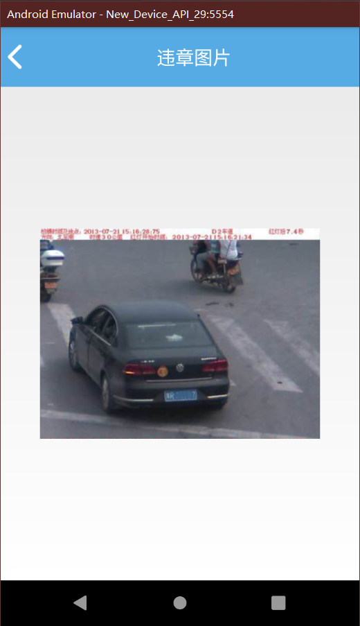
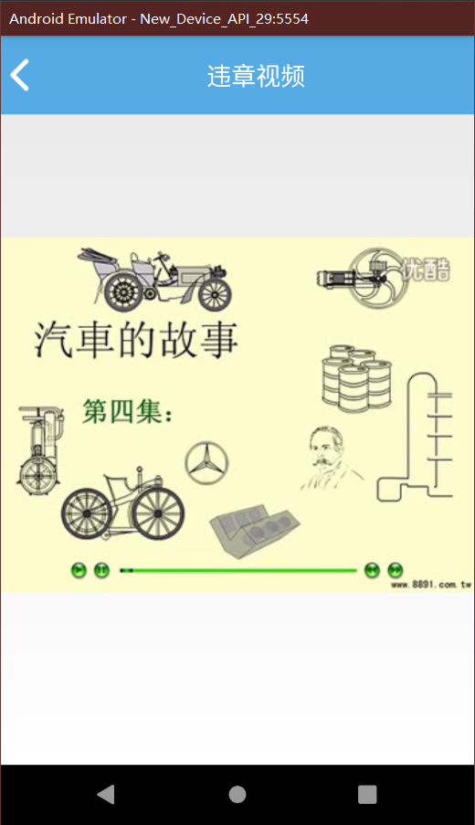

# 车辆违章


<div>
    
    
</div>


## **最上面的两个按钮**

```xml
<LinearLayout
        android:layout_width="wrap_content"
        android:layout_height="wrap_content">

        <TextView
            android:id="@+id/tv_sp"
            android:textColor="#000"
            android:textStyle="bold"
            android:text="违章视频"
            android:textSize="25sp"
            android:gravity="center"
            android:background="@drawable/border_czjl"
            android:layout_width="180dp"
            android:layout_height="50dp"/>
        <TextView
            android:id="@+id/tv_tp"
            android:textColor="#000"
            android:textStyle="bold"
            android:text="违章视频"
            android:textSize="25sp"
            android:gravity="center"
            android:background="@drawable/cartitle"
            android:layout_width="180dp"
            android:layout_height="50dp"/>
    </LinearLayout>

    <View
        android:background="@color/light_gray"
        android:layout_width="match_parent"
        android:layout_height="2dp" />
```

**下面用一个`GridView`用不同数据填充**

```xml
 <GridView
        android:id="@+id/gv_05"
        android:layout_marginTop="30dp"
        android:numColumns="4"
        android:verticalSpacing="50dp"
        android:layout_width="match_parent"
        android:layout_height="match_parent" />
```


**`java`代码**

**控件**

```java
        tv_sp = (TextView) view.findViewById(R.id.tv_sp);
        tv_tp = (TextView) view.findViewById(R.id.tv_tp);
        gv_05 = (GridView) view.findViewById(R.id.gv_05);
```

## **适配器和点击事件监听**

```java
 hashMaps = new ArrayList<>(); //存图片和对应文字得集合
//SimpleAdapter 适配器
 adapter = new SimpleAdapter(getContext(), hashMaps, R.layout.item5_gv,new String[]{"iv","tv"},new int[]{R.id.iv_05,R.id.tv_05});
        initData(ship,"视频");
  gv_05.setAdapter(adapter);//设置设配器
	//tv_sp上面得违章视频TextView
  tv_sp.setOnClickListener(new View.OnClickListener() {
            @Override
            public void onClick(View v) {
 				//将未点击的控件设置灰底边框             
 				tv_tp.setBackgroundResource(R.drawable.cartitle);
 				//将点击的控件设置白底边框          
                tv_sp.setBackgroundResource(R.drawable.border_czjl);
      			//对应更新hashMaps里得数据      
    		   initData(ship,"视频");
            }
        });
```

## **对应集合数据**

```java
final ArrayList<Integer> img = new ArrayList<Integer>() {{
            add(R.drawable.weizhang01);
            add(R.drawable.weizhang02);
            add(R.drawable.weizhang03);
            add(R.drawable.weizhang04);
        }};
        final ArrayList<Integer> ship = new ArrayList<Integer>() {{
            add(R.drawable.video_icon);
            add(R.drawable.video_icon);
            add(R.drawable.video_icon);
            add(R.drawable.video_icon);
        }};
```

## **提出来`initData()`方法来更新`hashMaps`数据**

```java
private void initData(ArrayList<Integer> img, String s) {
        hashMaps.clear();
        for (int i = 0; i < 4; ++i) {
            HashMap<String, Object> item1 =
             	new HashMap<String, Object>();
            item1.put("iv", img.get(i));
            item1.put("tv", s);
            hashMaps.add(item1);
        }
        adapter.notifyDataSetChange();
    }
```

## **`GridView`的点击事件监听**

```java
 gv_05.setOnItemClickListener(new AdapterView.OnItemClickListener() {
            @Override
            public void onItemClick(AdapterView<?> parent, View view, int position, long id) {
                 Intent intent ;
                //判断集合中的tv键对应值是否为空 为空则为违章图片查看
                if (hashMaps.get(position).get("tv") == null) {//违章图片
                    //跳转到图片查看的Activity
                    intent = new Intent(getContext(), ImgActivity.class);
                    //将对应图片传递过去
                    intent.putExtra("img", img.get(position));
                } else {//违章视频
                    //跳转到视频查看的Activity
                    intent = new Intent(getContext(), VcActivity.class);
                    //将对应的视频序号传递
                    intent.putExtra("void", position);
                }
                startActivity(intent);
            }
        });
```


## **`ImgActivity.class`的代码**


```java
  @Override
    protected void onCreate(@Nullable Bundle savedInstanceState) {
        requestWindowFeature(Window.FEATURE_NO_TITLE);
        getWindow().setFlags(WindowManager.LayoutParams.FLAG_FULLSCREEN,
                WindowManager.LayoutParams.FLAG_FULLSCREEN);
        super.onCreate(savedInstanceState);
        setContentView(R.layout.activity_img);
        initView();
    }

    private void initView() {//插件生成
        tv_back = (ImageView) findViewById(R.id.tv_back);
        tv_title = (TextView) findViewById(R.id.tv_title);
        img = (ImageView) findViewById(R.id.img);
        tv_back.setOnClickListener(new View.OnClickListener() {
            @Override
            public void onClick(View v) {
                finish();
            }
        });
        tv_title.setText("违章图片");
        //取出上面fragment传递过来的图片
        img.setImageResource(getIntent().getIntExtra("img", R.drawable.weizhang01));
        //设置ImageView控件缩放
        img.setOnTouchListener(new Zoom());
    }
```


## **布局代码`activity_img.xml`**

```xml
<?xml version="1.0" encoding="utf-8"?>
<LinearLayout xmlns:android="http://schemas.android.com/apk/res/android"
    android:orientation="vertical"
    android:layout_width="match_parent"
    android:layout_height="match_parent">

    <include layout="@layout/title"/>
	
    //不使用相对布局缩放会以固定位置放大缩小
    <RelativeLayout
        android:layout_width="match_parent"
        android:layout_height="match_parent">
        <ImageView
            android:id="@+id/img"
            android:layout_centerInParent="true"
            android:src="@drawable/weizhang01"
            android:layout_width="300dp"   //初始大小必须设死不然无法缩放
            android:layout_height="300dp" />
    </RelativeLayout>
</LinearLayout>
```



## **`VcActivity.class`代码**

```java
public class VcActivity extends Activity {

    private ImageView tv_back;
    private TextView tv_title;
    private ImageView im_ref;
    private VideoView vv;
    private ArrayList<Integer> vc = new ArrayList<Integer>() {{
        add(R.raw.car1);
        add(R.raw.car2);
        add(R.raw.car3);
        add(R.raw.car4);
    }};
    @Override
    protected void onCreate(@Nullable Bundle savedInstanceState) {
        requestWindowFeature(Window.FEATURE_NO_TITLE);
        getWindow().setFlags(WindowManager.LayoutParams.FLAG_FULLSCREEN,
                WindowManager.LayoutParams.FLAG_FULLSCREEN);
        super.onCreate(savedInstanceState);
        setContentView(R.layout.activity_vc);
        initView();
    }

    private void initView() { //插件生成
        tv_back = (ImageView) findViewById(R.id.tv_back);
        tv_title = (TextView) findViewById(R.id.tv_title);
        im_ref = (ImageView) findViewById(R.id.im_ref);
        vv = (VideoView) findViewById(R.id.vv);
        tv_title.setText("违章视频");
        tv_back.setOnClickListener(new View.OnClickListener() {
            @Override
            public void onClick(View v) {
                finish();
            }
        });
        //获得上面fragment传递过来的点击的视频位置
        int v = getIntent().getIntExtra("vc", 1);
        MediaController mediaController = new MediaController(getApplicationContext());
        //设置播放的视频
        vv.setVideoURI(Uri.parse("android.resource://" + getPackageName() + "/" + vc.get(v)));
        mediaController.setMediaPlayer(vv);
        vv.start();
        mediaController.show();
    }
```


## **布局代码`activity_vc.xml`**

```xml
<?xml version="1.0" encoding="utf-8"?>
<LinearLayout xmlns:android="http://schemas.android.com/apk/res/android"
    android:orientation="vertical" android:layout_width="match_parent"
    android:layout_height="match_parent">

    <include layout="@layout/title" />

    <VideoView
        android:id="@+id/vv" 
        android:layout_marginTop="100dp" //竖屏要上面marginTop100dp才能大概居中，不能用paddingTop没有效果
        android:layout_width="match_parent"
        android:layout_height="match_parent" />
</LinearLayout>
```




